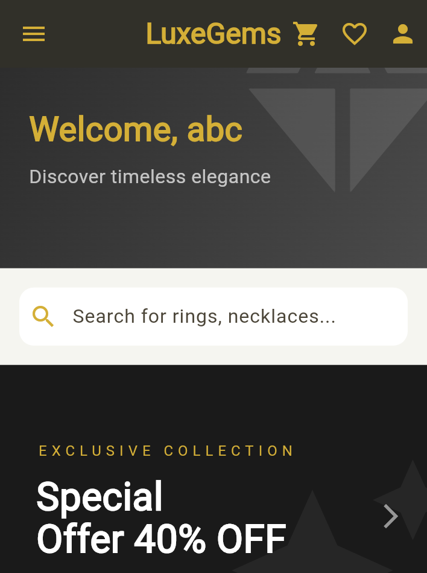
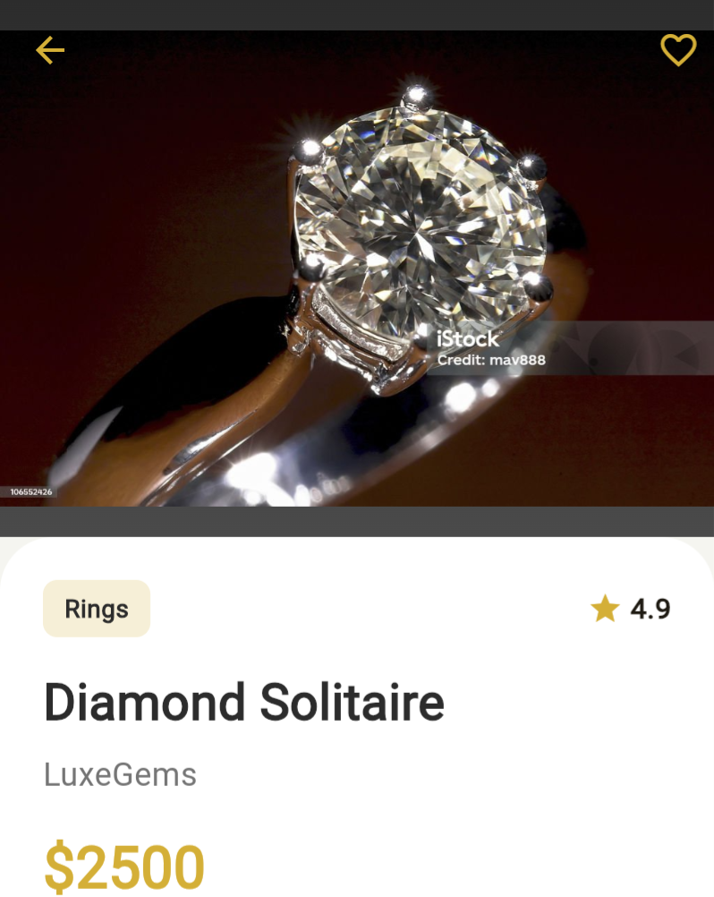

markdown
# LuxeGems - Luxury Jewelry E-Commerce App

A premium, elegant jewelry shopping application built using Flutter. This app features a sophisticated UI designed to showcase high-end jewelry items including rings, necklaces, earrings, and bracelets.

## ✨ Features
- **User Authentication:** Secure Sign In and Sign Up screens with form validation.
- **Product Catalog:** Browse through 40+ curated items across 4 categories.
- **Detailed Product Views:** View product materials (Gold, Diamond, Platinum), ratings, and brand information.
- **Responsive Design:** Optimized for a seamless experience across various mobile screen sizes.
- **Premium UI:** Dark-themed aesthetic with gold accents (`#D4AF37`) for a luxury feel.

[//]: # (## 📸 Screenshots)

[//]: # (| Login Screen                           | Dashboard | Product Details |)

[//]: # (|----------------------------------------|-----------|-----------------|)

[//]: # (| ![Login]&#40;Screenshots/loginScreen1.png&#41; | ![Dashboard] | ![Details]&#40;https://via.placeholder.com/200x400?text=Product+UI&#41; |)

[//]: # (*&#40;Note: Replace these placeholders with actual screenshots from your app&#41;*)

| Login Screen                           | Dashboard                                | Product Details                            |
|----------------------------------------|------------------------------------------|--------------------------------------------|
|  |  |  |

## 🛠️ Technologies Used
- **Framework:** [Flutter](https://flutter.dev/)
- **Language:** [Dart](https://dart.dev/)
- **State Management:** Custom State Handling logic
- **Design System:** Material Design 3

## 🚀 Getting Started

### Prerequisites
- Flutter SDK installed on your machine.
- Android Studio / VS Code with Flutter extensions.

### Installation
1. Clone the repository:
2. Navigate to the project directory:
3. Get the dependencies:
4. Run the app:

## 📂 Project Structure
- `lib/main.dart`: Main entry point containing the Auth logic and Dashboard UI.
- `assets/appimages/`: Directory containing all high-quality jewelry product images.

---
Developed by Eman Tahir

